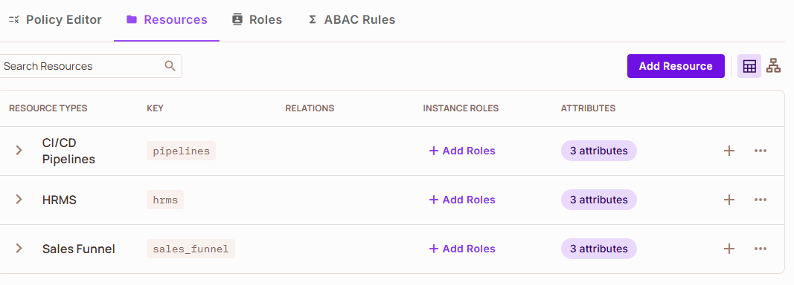
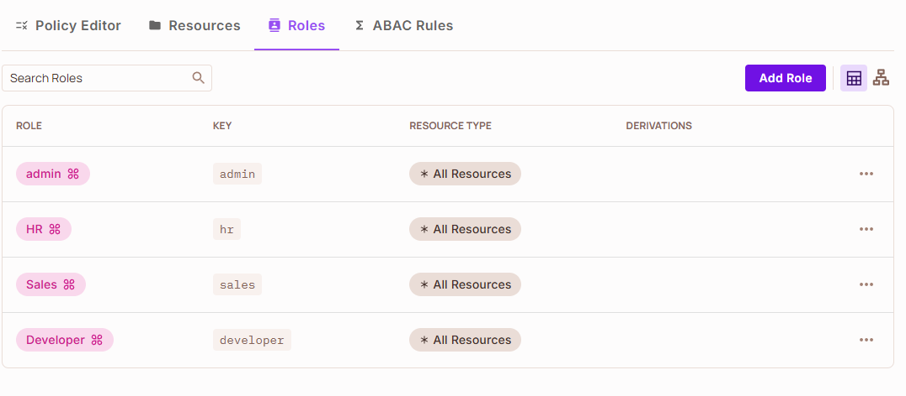
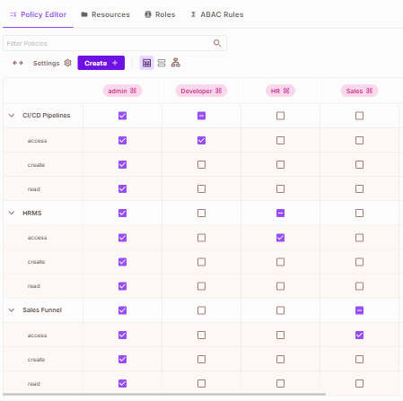
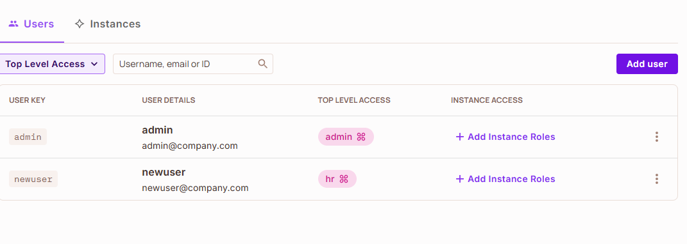

# Internal Tools Access Panel

This is a simple role-based access control panel built with Next.js and integrated with Permit.io, created as an entry for the [Permit.io x DEV Community Challenge](https://dev.to/challenges/permit_io).

The panel lets authenticated users access different internal tools (like HR, Sales, Pipelines) based on their assigned roles. Admins can manage access centrally, and the system dynamically maps users to tool pages according to their role permissions.

## Features

-   Session-based authentication
-   Role-to-resource access mapping
-   Dynamic route access enforcement
-   Unauthorized access handling
-   Seamless integration with Permit.io for role & policy management

## ⚙️ Prerequisites: Permit.io Setup

Before running the project, you’ll need to configure the following in your Permit.io dashboard:

### 🧱 Resources

Create the resources (CI/CD Pipelines, HRMS, Sales Funnel):

-   Resource Key: ( `pipelines` for **CI/CD Pipelines**, `hrms` for **HRMS** & `sales_funnel` for **Sales Funnel** )
-   Actions: read, create, access

> This represents the internal tools (e.g., HR, Sales, Pipelines).



### 🧑‍🤝‍🧑 Roles

Create the roles ():

-   admin
-   hr
-   sales
-   developer

> These will be used to grant permissions to specific tools via policy rules.



### 📜 Policy (RBAC)

Create a policy that maps roles to resources using the following action mapping:
| | Admin | developer | HR | Sales
| ------ | ------------- | ------------------------------- | ------------------------------- | ----------
| CI/CD Pipelines | ✅ | | |
| access | ✅ | ✅ | |
| create | ✅ | | |
| read | ✅ | | |
| HRMS | ✅ | | |
| access | ✅ | | ✅ |
| create | ✅ | | |
| read | ✅ | | |
| Sales Funnel | ✅ | | |
| access | ✅ | | | ✅
| create | ✅ | | |
| read | ✅ | | |

> These will be used to grant permissions to specific tools via policy rules.



### 👤 Users

Create users and assign them roles.

-   Admin
    -   key: `admin`
    -   role: `admin`
-   HR
    -   key: `newuser`
    -   role: `hr`



## Repository Setup

-   Clone the project
-   Add `.env` file
-   Install packages
-   Start project

### Environment Variables

```console
PERMIT_API_KEY=''
USERS='[{"username":"admin","password":"2025DEVChallenge","role":"admin"},{"username":"newuser","password":"2025DEVChallenge","role":"hr"}]'
```

| Name              | Type   | Key            | Description                                               |
| ----------------- | ------ | -------------- | --------------------------------------------------------- |
| Permit.io API Key | String | PERMIT_API_KEY | The Permit.io API key for the project                     |
| Users list        | String | USERS          | An array of user details (`[{username, password, role}]`) |

## License

`Internal Tools Access Panel` project is open-sourced software licensed under the [MIT license](LICENSE).

## Purpose

This project was built to explore and demonstrate how Permit.io can simplify access control in internal dashboards, and serves as a solid starting point for teams managing internal tools with minimal boilerplate.
